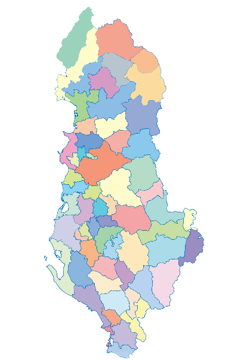

# albania-map

You will find the layout (psd & svg) of city halls of Albania map from the administrative division made in Albania in 2016, which shrinked the number of **city halls into 61**.

## Questions
If you have any questions please use the Issues tab or submit a pull request. 

## Contributors
[@ilirhushi](http://ilirhushi.me) & [@edyrkaj](http://www.e-soft.al/Main.aspx)
